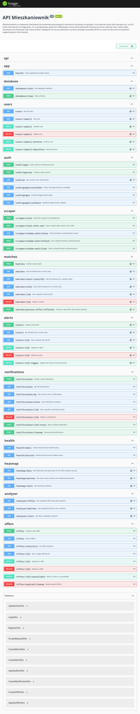
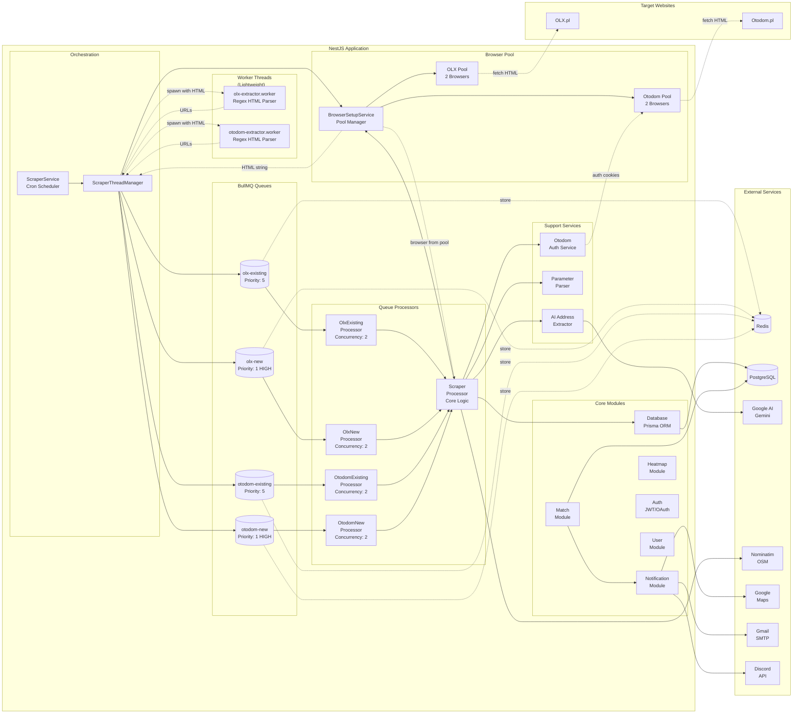
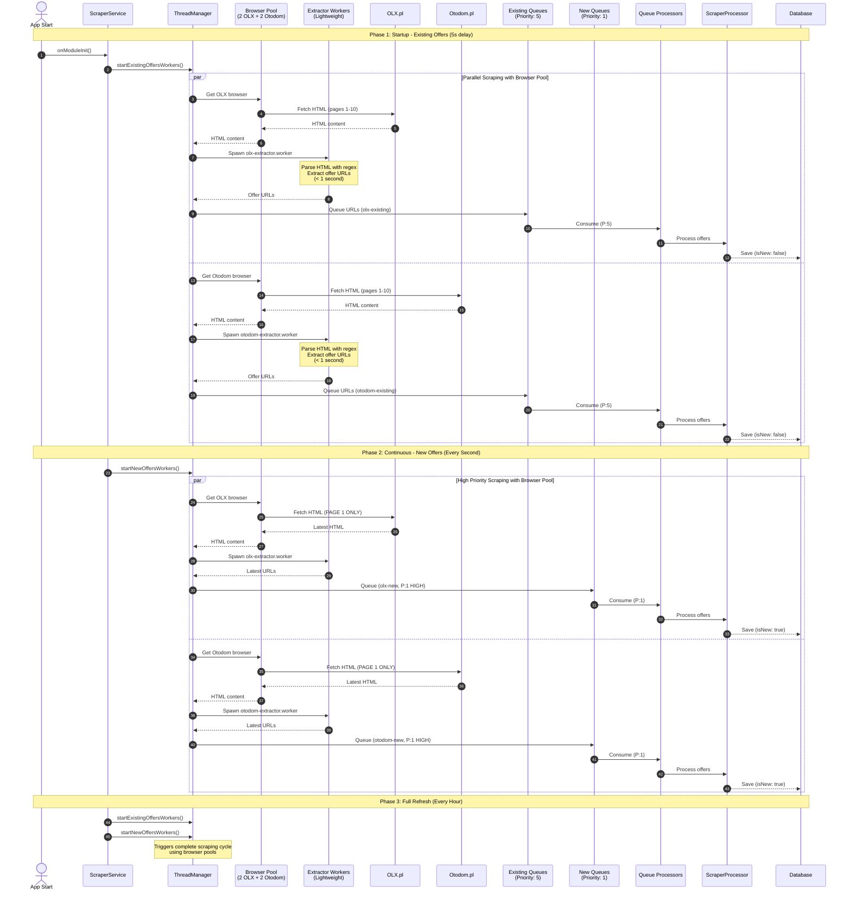
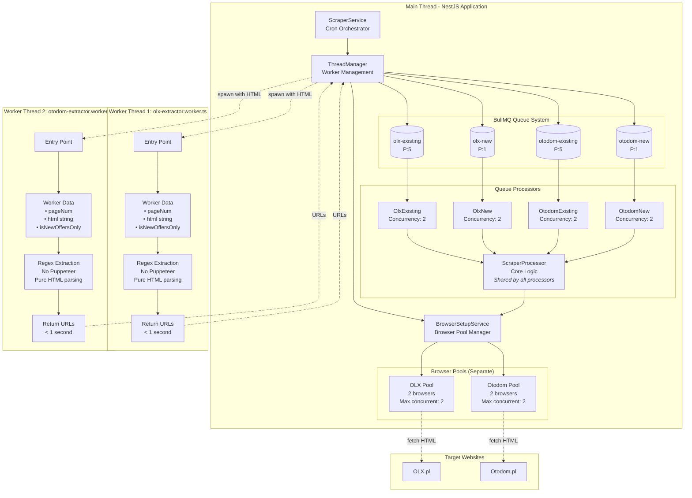
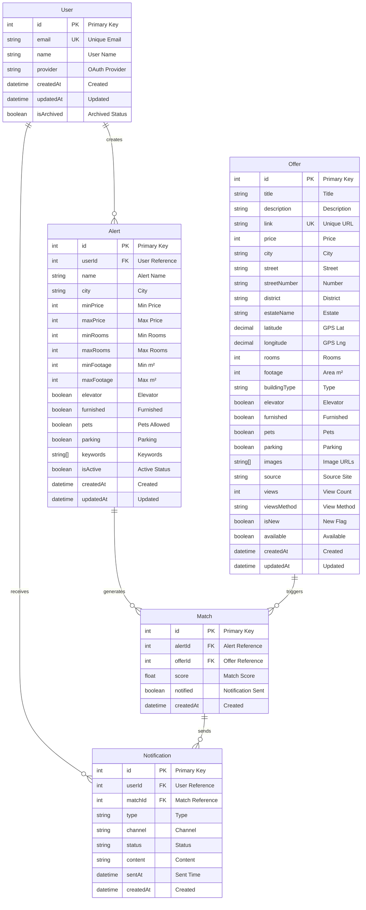

  

    <strong>Your key to student housing</strong>

## Tech Stack

    

   

   

   

 

## About the Project

**Mieszkaniownik** is a solution designed for students looking for an apartment or room to rent. With the current turnover of rental offers on platforms like OLX, every second counts. Why spend hours refreshing the website when you can simply create an alert, specify what kind of apartment you're interested in and your budget? Then, as soon as an offer appears, you'll receive a notification via email or Discord with all the most important information.

### Target Audience

Students looking for a room or apartment

### Added Value

- **Time saved** - automatic offer monitoring instead of manual refreshing
- **Faster apartment finding** - instant notifications about new offers
- **More offers to choose from** - aggregation from multiple sources
- **Stress reduction** - no fear or stress associated with apartment hunting

### API Documentation

## System Overview

## Multi-Threading Architecture

## Scraping Algorithm

```mermaid
flowchart TB
    START([App Start<br/>+5s delay])
    START --> INIT[Init Service<br/>startExistingWorkers]
    INIT --> BROWSER_POOL[Browser Pool Init<br/>2 OLX + 2 Otodom browsers]

    BROWSER_POOL --> SPLIT_EXIST{ }
    SPLIT_EXIST --> OLX_EXIST[OLX Main Thread]
    SPLIT_EXIST --> OTDM_EXIST[Otodom Main Thread]

    OLX_EXIST --> OLX_FETCH[Fetch HTML via Browser Pool<br/>Pages 1-10]
    OTDM_EXIST --> OTDM_FETCH[Fetch HTML via Browser Pool<br/>Pages 1-10]

    OLX_FETCH --> OLX_WORKER[Spawn olx-extractor.worker<br/>Parse HTML with regex]
    OTDM_FETCH --> OTDM_WORKER[Spawn otodom-extractor.worker<br/>Parse HTML with regex]

    OLX_WORKER --> OLX_Q[olx-existing<br/>P:5]
    OTDM_WORKER --> OTDM_Q[otodom-existing<br/>P:5]

    OLX_Q --> OLX_PROC[OlxExistingProc]
    OTDM_Q --> OTDM_PROC[OtodomExistingProc]

    OLX_PROC --> MERGE_EXIST{ }
    OTDM_PROC --> MERGE_EXIST

    MERGE_EXIST --> CRON_SEC([Every Second<br/>Cron Job])
    CRON_SEC --> NEW_INIT[Start New Workers]
    NEW_INIT --> SPLIT_NEW{ }

    SPLIT_NEW --> OLX_NEW[OLX Main Thread]
    SPLIT_NEW --> OTDM_NEW[Otodom Main Thread]

    OLX_NEW --> OLX_NEW_FETCH[Fetch HTML via Browser Pool<br/>PAGE 1 ONLY]
    OTDM_NEW --> OTDM_NEW_FETCH[Fetch HTML via Browser Pool<br/>PAGE 1 ONLY]

    OLX_NEW_FETCH --> OLX_NEW_WORKER[Spawn olx-extractor.worker]
    OTDM_NEW_FETCH --> OTDM_NEW_WORKER[Spawn otodom-extractor.worker]

    OLX_NEW_WORKER --> OLX_NEW_Q[olx-new<br/>P:1 HIGH]
    OTDM_NEW_WORKER --> OTDM_NEW_Q[otodom-new<br/>P:1 HIGH]

    OLX_NEW_Q --> OLX_NEW_PROC[OlxNewProc]
    OTDM_NEW_Q --> OTDM_NEW_PROC[OtodomNewProc]

    OLX_NEW_PROC --> MERGE_NEW{ }
    OTDM_NEW_PROC --> MERGE_NEW

    MERGE_NEW --> MAIN_PROC[ScraperProcessor<br/>Main Logic]

    MAIN_PROC --> BROWSER[Browser Setup<br/>From Pool]
    BROWSER --> AUTH{Otodom?}
    AUTH -->|Yes| OTODOM_AUTH[Apply Auth<br/>Cookies]
    AUTH -->|No| PARSE
    OTODOM_AUTH --> PARSE[Parse Parameters<br/>Extract Data]
    PARSE --> AI[AI Extraction<br/>Google Gemini]
    AI --> GEO[Geocoding<br/>Nominatim OSM]
    GEO --> SAVE[Save to DB<br/>PostgreSQL]
    SAVE --> MATCH[Match Check<br/>Score Calculation]
    MATCH --> DECISION{Match Found?}

    DECISION -->|Yes| NOTIFY[Send Notification<br/>Email + Discord]
    DECISION -->|No| END[Job Complete]
    NOTIFY --> END

    CRON_HOUR([Every Hour<br/>Full Refresh])
    CRON_HOUR --> FULL[Run Both Workers<br/>Existing + New]
    FULL --> BROWSER_POOL
    END --> CRON_SEC
```

## Worker Thread

## Database Schema

