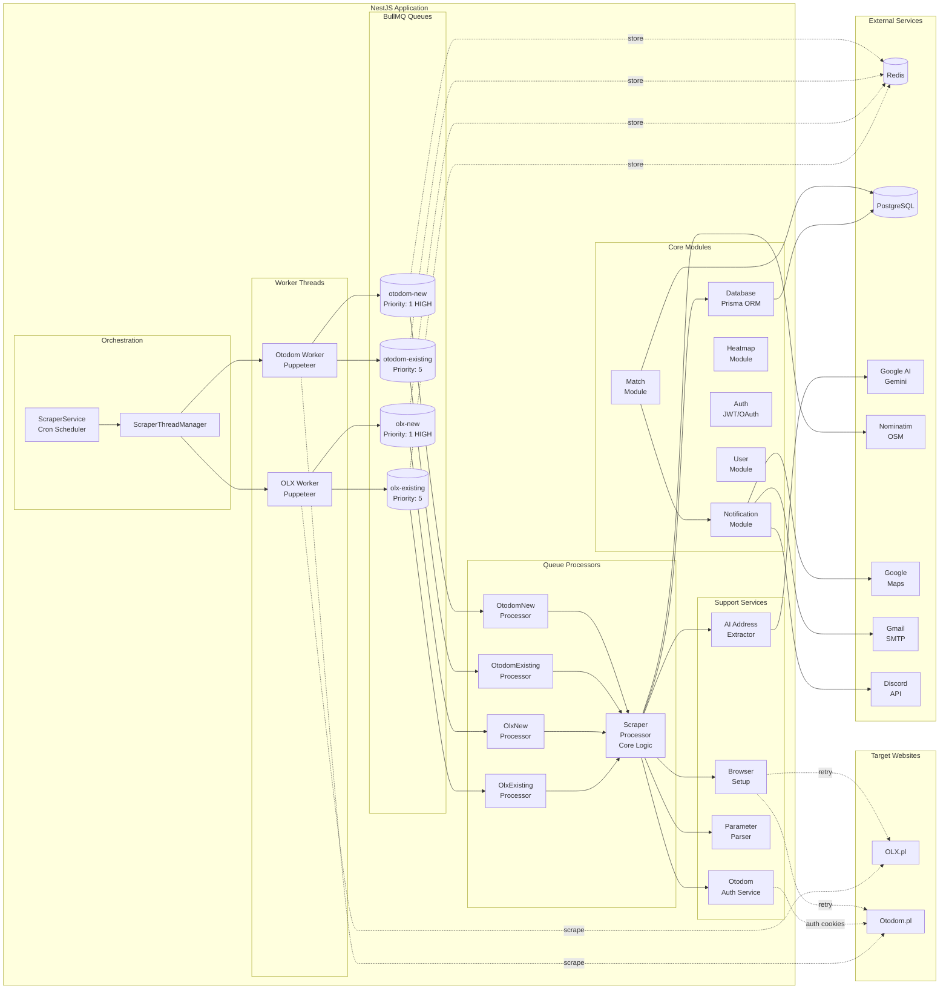
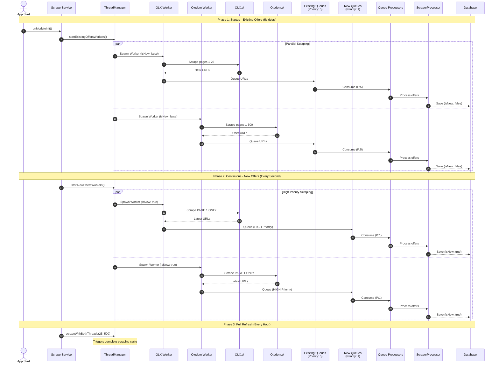
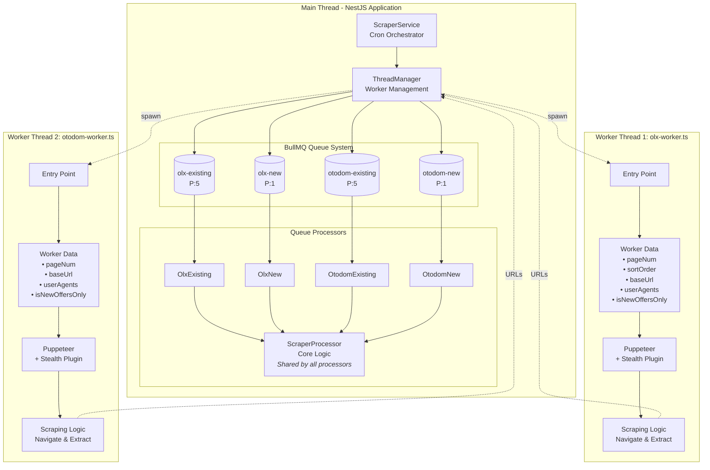

  

> **Twój klucz do studenckiego mieszkania**

### Backend:     

### Scraping & Automation:    

### AI & Services:    

### DevOps:   

### Status:  

## O Projekcie

**Mieszkaniownik** to rozwiązanie skierowane dla studentów poszukujących mieszkania lub pokoju na wynajem. Przy obecnej rotacji ofert wynajmu np. na OLX każda sekunda jest na wagę złota. Po co przepatrywać godzinami odświeżając stronę internetową, jeśli możemy po prostu utworzyć alert, wpisać jakie mieszkanie nas interesuje i jaki mamy budżet? Następnie od razu po pokazaniu się oferty dostajesz powiadomienie na maila lub Discorda z wszystkimi najważniejszymi informacjami.

### Grupa Docelowa

Studenci poszukujący pokoju lub mieszkania

### Wartość Dodana

- **Zaoszczędzony czas** - automatyczne monitorowanie ofert zamiast ręcznego odświeżania
- **Szybsze znalezienie mieszkania** - natychmiastowe powiadomienia o nowych ofertach
- **Więcej ofert do wyboru** - agregacja z wielu źródeł
- **Redukcja stresu** - żadnego strachu i stresu związanego z poszukiwaniem mieszkania

## System Overview

## Multi-Threading Architecture

## Scraping Algorithm Flow

```mermaid
flowchart TB
    START([App Start<br/>+5s delay])
    START --> INIT[Init Service<br/>startExistingWorkers]
    INIT --> SPAWN_EXIST[Spawn 2 Threads]

    SPAWN_EXIST --> SPLIT_EXIST{ }
    SPLIT_EXIST --> OLX_EXIST[OLX Worker<br/>isNew: false]
    SPLIT_EXIST --> OTDM_EXIST[Otodom Worker<br/>isNew: false]

    OLX_EXIST --> OLX_SCRAPE[Scrape 25 pages<br/>Extract URLs]
    OTDM_EXIST --> OTDM_SCRAPE[Scrape 500 pages<br/>Extract URLs]

    OLX_SCRAPE --> OLX_Q[olx-existing<br/>P:5]
    OTDM_SCRAPE --> OTDM_Q[otodom-existing<br/>P:5]

    OLX_Q --> OLX_PROC[OlxExistingProc]
    OTDM_Q --> OTDM_PROC[OtodomExistingProc]

    OLX_PROC --> MERGE_EXIST{ }
    OTDM_PROC --> MERGE_EXIST

    MERGE_EXIST --> CRON_SEC([Every Second<br/>Cron Job])
    CRON_SEC --> NEW_INIT[Start New Workers]
    NEW_INIT --> SPAWN_NEW[Spawn 2 Threads]

    SPAWN_NEW --> SPLIT_NEW{ }
    SPLIT_NEW --> OLX_NEW[OLX Worker<br/>isNew: true]
    SPLIT_NEW --> OTDM_NEW[Otodom Worker<br/>isNew: true]

    OLX_NEW --> OLX_NEW_SCRAPE[Scrape PAGE 1<br/>Latest URLs]
    OTDM_NEW --> OTDM_NEW_SCRAPE[Scrape PAGE 1<br/>Latest URLs]

    OLX_NEW_SCRAPE --> OLX_NEW_Q[olx-new<br/>P:1 HIGH]
    OTDM_NEW_SCRAPE --> OTDM_NEW_Q[otodom-new<br/>P:1 HIGH]

    OLX_NEW_Q --> OLX_NEW_PROC[OlxNewProc]
    OTDM_NEW_Q --> OTDM_NEW_PROC[OtodomNewProc]

    OLX_NEW_PROC --> MERGE_NEW{ }
    OTDM_NEW_PROC --> MERGE_NEW

    MERGE_NEW --> MAIN_PROC[ScraperProcessor<br/>Main Logic]

    MAIN_PROC --> BROWSER[Browser Setup<br/>Puppeteer]
    BROWSER --> AUTH{Otodom?}
    AUTH -->|Yes| OTODOM_AUTH[Apply Auth<br/>Cookies]
    AUTH -->|No| PARSE
    OTODOM_AUTH --> PARSE[Parse Parameters<br/>Extract Data]
    PARSE --> AI[AI Extraction<br/>Google Gemini]
    AI --> GEO[Geocoding<br/>Nominatim OSM]
    GEO --> SAVE[Save to DB<br/>PostgreSQL]
    SAVE --> MATCH[Match Check<br/>Score Calculation]
    MATCH --> DECISION{Match Found?}

    DECISION -->|Yes| NOTIFY[Send Notification<br/>Email + Discord]
    DECISION -->|No| END[Job Complete]
    NOTIFY --> END

    CRON_HOUR([Every Hour<br/>Full Refresh])
    CRON_HOUR --> FULL[Full Scrape<br/>scrapeWithBothThreads]
    FULL --> SPAWN_EXIST
    END --> CRON_SEC
```

## Worker Thread Implementation

## Database Schema & Data Flow

